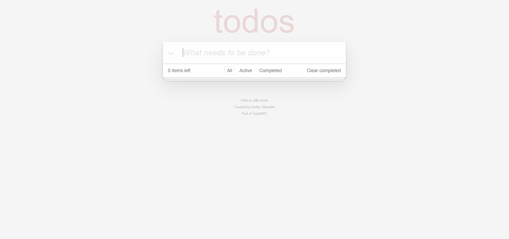
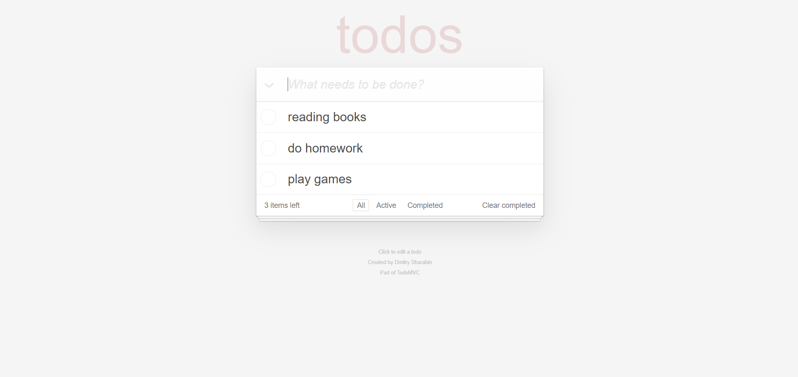
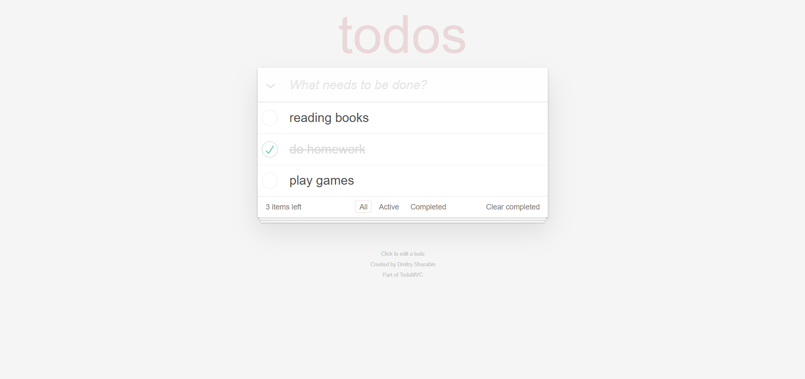
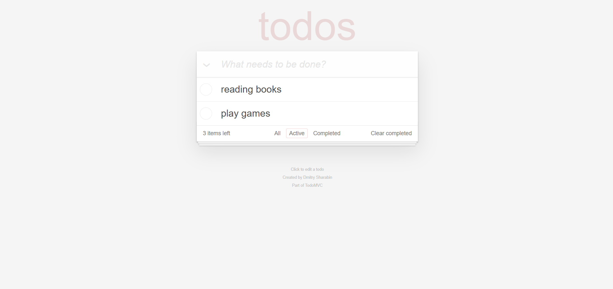
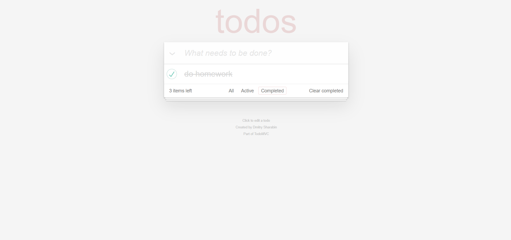

# Patika+ Frontend Bootcamp Hafta-12 (Todo App)

Bu proje, bir **Todo List** (Yapılacaklar Listesi) uygulamasıdır. Kullanıcılar, görevler ekleyebilir, tamamlayabilir, silebilir ve tamamlanmış görevleri temizleyebilirler. Veriler **localStorage**'da saklanır, bu sayede sayfa yenilendiğinde veriler kaybolmaz.

## Özellikler

- **Yeni görev ekleme**: Kullanıcı, yeni bir görev eklemek için metin kutusunu kullanabilir.
- **Görev tamamlama**: Kullanıcı, bir görevi tamamlanmış olarak işaretlemek için bir onay kutusuna tıklayabilir.
- **Görev silme**: Kullanıcı, bir görevi silmek için çarpı butonuna tıklayabilir.
- **Filtreleme**: Kullanıcı, görevleri aşağıdaki üç duruma göre filtreleyebilir:
  - **Tümü**: Tüm görevler listelenir.
  - **Aktif**: Sadece tamamlanmamış görevler listelenir.
  - **Tamamlanmış**: Sadece tamamlanmış görevler listelenir.
- **Tamamlanmış görevleri temizleme**: Kullanıcı, tamamlanmış tüm görevleri tek tıklamayla temizleyebilir.
- **Veri saklama**: Tüm görevler **localStorage**'a kaydedilir, böylece sayfa yenilendiğinde veriler kaybolmaz.

## Kurulum

1. Bu repo'yu bilgisayarınıza indirin:
    ```bash
    git clone https://github.com/emreykaya/w12-todo-app.git
    ```

2. Projeye gidin:
    ```bash
    cd w12-todo-app
    ```

3. Gerekli bağımlılıkları yükleyin:
    ```bash
    npm install
    ```

4. Uygulamayı başlatın:
    ```bash
    npm start
    ```

Uygulama, [http://localhost:3000](http://localhost:3000) adresinde çalışacaktır.

## Teknolojiler

- **React**: Uygulamanın temel kütüphanesi.
- **CSS**: Stil için kullanılan temel stil sayfası.
- **localStorage**: Verileri tarayıcıda saklamak için kullanılır.

## Kullanıcı Arayüzü

## Ekran Görüntüleri






